# 👋 Hi, I'm Pritom Siddique!

<div align="center">
  
</div>

<div align="center">
  <a href="https://github.com/pritomit">
    
  </a>
  <a href="https://www.linkedin.com/in/pritom-siddique-308623294">
    
  </a>
  <a href="https://pritomsiddique.blogspot.com/">
    
  </a>
  <a href="mailto:pritomsiddique@gmail.com">
    
  </a>
</div>

---

## 🎯 About Me

```
┌──────────────────────────────────────────┐
│  Passionate Full-Stack Developer & Hacker│
│  From: Bangladesh 🇧🇩                   │
│  Focus: Security | Code | Community     │
│  Motto: Privacy is not a crime,         │
│         Security is not a luxury       │
└──────────────────────────────────────────┘
```

<!-- ═══════════════════════════════════════════════════════════════
     HACKING RESOURCES — বাংলা README
     লেখক: প্রিতম সিদ্দিকী
     লাইসেন্স: শুধুমাত্র শিক্ষামূলক ব্যবহারের জন্য
     ═══════════════════════════════════════════════════════════════ -->

<div align="center">


**এথিক্যাল হ্যাকার ও পেনিট্রেশন টেস্টারদের জন্য সংগৃহীত রিসোর্স**

[](./)
[](./)
[](./)

[🇬🇧 English](./README.md) · **🇧🇩 বাংলা**

</div>

---

## 📌 এই রেপো সম্পর্কে

এই রেপোতে **এথিক্যাল হ্যাকিং** এবং **পেনিট্রেশন টেস্টিং** শেখার জন্য প্রয়োজনীয় সবকিছু এক জায়গায় সংগৃহীত হয়েছে — বই, টুল, চিটশিট, CTF প্ল্যাটফর্ম, এবং ধাপে ধাপে শেখার পথ।

> ⚠️ **শুধুমাত্র শিক্ষামূলক ব্যবহারের জন্য।**
> অনুমতি ছাড়া কোনো সিস্টেমে এই টুলগুলো ব্যবহার করা **বেআইনি** এবং শাস্তিযোগ্য অপরাধ।

> 🔗 **আমার ৩৫০+ TryHackMe রুমের তালিকা:** [tryhackme-roadmap](https://github.com/rng70/tryhackme-roadmap)

---

## 🧭 সূচিপত্র

| 📚 **শেখা** | 🛠️ **রিসোর্স** | 🎯 **প্র্যাকটিস** |
|:---:|:---:|:---:|
| [শেখার রোডম্যাপ](#-শেখার-রোডম্যাপ) | [বইয়ের তালিকা](#-বইয়ের-তালিকা) | [CTF প্ল্যাটফর্ম](#-ctf-প্ল্যাটফর্ম) |
| [মূল দক্ষতা](#-মূল-দক্ষতা) | [টুলস](#-টুলস) | [TryHackMe রোডম্যাপ](#-tryhackme-রোডম্যাপ) |
| [শব্দকোষ](#-শব্দকোষ) | [SQL Injection চিটশিট](#-sql-injection-চিটশিট) | [পরীক্ষার প্রস্তুতি](#-পরীক্ষার-প্রস্তুতি) |
| [Hacker101 সিলেবাস](#-hacker101-সিলেবাস) | [বাগ বাউন্টি গাইড](#-বাগ-বাউন্টি-গাইড) | [ব্লগ পোস্ট সিরিজ](#-ব্লগ-পোস্ট-সিরিজ) |

---

# 🗺️ শেখার রোডম্যাপ

> **আনুমানিক সময়:** ৬–৯ মাস (প্রতিদিন ২ ঘণ্টা)
> **কঠিনতার মাত্রা:** 🟢 প্রাথমিক · 🟡 মধ্যবর্তী · 🔴 উন্নত

```mermaid
graph LR
    A[🟢 নেটওয়ার্কিং<br/>TCP/UDP/HTTP] --> B[🟢 Linux ও<br/>Kali সেটআপ]
    B --> C[🟡 ওয়েব বেসিক<br/>HTML/SQL/PHP]
    C --> D[🟡 মূল টুল<br/>Nmap/Burp/SQLMap]
    D --> E[🟡 এক্সপ্লয়েট<br/>Metasploit]
    E --> F[🔴 ওয়্যারলেস<br/>Aircrack-ng]
    F --> G[🔴 পোস্ট-এক্সপ্লয়েট<br/>PrivEsc/Pivoting]
    G --> H[🔴 বিশেষায়ন<br/>Web/Cloud/RE]

    style A fill:#00ff00,color:#000
    style B fill:#00ff00,color:#000
    style C fill:#ffcc00,color:#000
    style D fill:#ffcc00,color:#000
    style E fill:#ffcc00,color:#000
    style F fill:#ff4444,color:#fff
    style G fill:#ff4444,color:#fff
    style H fill:#ff4444,color:#fff
```



### 📊 অগ্রগতি ট্র্যাকার

```
📘 ফেজ ১ — ভিত্তি                [████████████████████] ১০০%  ✅
📗 ফেজ ২ — টুলিং                 [██████████████░░░░░░]  ৭০%  🔄
📙 ফেজ ৩ — ওয়েব সিকিউরিটি       [██████████░░░░░░░░░░]  ৫০%  🔄
📕 ফেজ ৪ — এক্সপ্লয়েটেশন         [██████░░░░░░░░░░░░░░]  ৩০%  ⏳
📓 ফেজ ৫ — ওয়্যারলেস/PrivEsc     [██░░░░░░░░░░░░░░░░░░]  ১০%  ⏳
📔 ফেজ ৬ — বিশেষায়ন             [░░░░░░░░░░░░░░░░░░░░]   ০%  🔒
```

---

## 📖 ফেজ ১ — ভিত্তি (🟢 ৪–৬ সপ্তাহ)

<details open>
<summary><b>বিস্তারিত দেখুন</b></summary>

| # | টপিক | রিসোর্স | সম্পন্ন |
|:-:|------|---------|:---:|
| ১ | TCP/IP, UDP, HTTP | `Computer Networks` — Tanenbaum | [ ] |
| ২ | OSI মডেল (৭টি লেয়ার) | [Cloudflare Learning](https://www.cloudflare.com/learning/ddos/glossary/open-systems-interconnection-model-osi/) | [ ] |
| ৩ | Linux বেসিক ও Debian কমান্ড | `The Linux Command Line` — W. Shotts | [ ] |
| ৪ | Kali Linux VM সেটআপ | [Kali Docs](https://www.kali.org/docs/) | [ ] |
| ৫ | HTML, CSS, JavaScript | [MDN Web Docs](https://developer.mozilla.org/) | [ ] |
| ৬ | SQL ফান্ডামেন্টাল | [SQLBolt](https://sqlbolt.com/) | [ ] |

</details>

## 📖 ফেজ ২ — টুলিং (🟡 ৬–৮ সপ্তাহ)

<details>
<summary><b>বিস্তারিত দেখুন</b></summary>

| # | টুল | কাজ | সম্পন্ন |
|:-:|------|------|:---:|
| ১ | **Nmap** | নেটওয়ার্ক ডিসকভারি, পোর্ট স্ক্যান | [ ] |
| ২ | **Burp Suite** | ওয়েব প্রক্সি, ইন্টারসেপশন | [ ] |
| ৩ | **SQLMap** | অটোমেটেড SQLi | [ ] |
| ৪ | **Metasploit** | এক্সপ্লয়েটেশন ফ্রেমওয়ার্ক | [ ] |
| ৫ | **Wireshark** | প্যাকেট বিশ্লেষণ | [ ] |
| ৬ | **Hydra / John / Hashcat** | ব্রুট-ফোর্স ও হ্যাশ ক্র্যাকিং | [ ] |
| ৭ | **Nessus / OpenVAS** | অটোমেটেড স্ক্যানিং | [ ] |
| ৮ | **Recon-ng / Amass** | OSINT ও রিকন | [ ] |

</details>

## 📖 ফেজ ৩ — ওয়েব সিকিউরিটি (🟡 ৬–৮ সপ্তাহ)

<details>
<summary><b>বিস্তারিত দেখুন</b></summary>

- [ ] OWASP Top 10 (সব ক্যাটাগরি)
- [ ] **ইনজেকশন:** SQLi, NoSQLi, Command Injection, SSTI
- [ ] **XSS:** Reflected, Stored, DOM-based
- [ ] **CSRF, SSRF, XXE**
- [ ] **LFI / RFI / Path Traversal**
- [ ] **IDOR ও Broken Access Control**
- [ ] **Authentication ও Session ত্রুটি**
- [ ] **ফাইল আপলোড দুর্বলতা**
- [ ] **API সিকিউরিটি** (REST, GraphQL)

</details>

## 📖 ফেজ ৪ — এক্সপ্লয়েটেশন (🔴 ৮–১০ সপ্তাহ)

<details>
<summary><b>বিস্তারিত দেখুন</b></summary>

- [ ] Metasploit Framework গভীরভাবে
- [ ] ম্যানুয়াল এক্সপ্লয়েটেশন (buffer overflow বেসিক)
- [ ] `msfvenom` দিয়ে পেলোড তৈরি
- [ ] শেল হ্যান্ডলিং ও আপগ্রেড
- [ ] অ্যান্টিভাইরাস এভ্যাশন কনসেপ্ট (প্রতিরক্ষামূলক বোঝাপড়া)
- [ ] CVE রিসার্চ ও PoC বিশ্লেষণ
- [ ] Privilege Escalation — Linux (SUID, cron, sudo, kernel)
- [ ] Privilege Escalation — Windows (tokens, services, UAC)

</details>

## 📖 ফেজ ৫ — ওয়্যারলেস ও পোস্ট-এক্সপ্লয়েটেশন (🔴 ৬–৮ সপ্তাহ)

<details>
<summary><b>বিস্তারিত দেখুন</b></summary>

- [ ] WPA/WPA2 হ্যান্ডশেক ক্যাপচার (শুধু নিজের ল্যাবে)
- [ ] `aircrack-ng` স্যুট — airmon-ng, airodump-ng, aireplay-ng
- [ ] Evil Twin / Rogue AP (অনুমোদিত ল্যাব)
- [ ] Pivoting ও tunneling (`chisel`, `ligolo`, `ssh -D`)
- [ ] Persistence মেকানিজম (প্রতিরক্ষামূলক অধ্যয়ন)
- [ ] Active Directory বেসিক

</details>

## 📖 ফেজ ৬ — বিশেষায়ন (🔴 চলমান)

<details>
<summary><b>একটি বা একাধিক বেছে নিন</b></summary>

- ☁️ **ক্লাউড সিকিউরিটি** (AWS, Azure, GCP)
- 🔍 **রিভার্স ইঞ্জিনিয়ারিং** (Ghidra, IDA, Radare2)
- 🧠 **ম্যালওয়্যার বিশ্লেষণ** (static + dynamic)
- 📱 **মোবাইল সিকিউরিটি** (Android, iOS)
- 🌐 **ওয়েব অ্যাপ বিশেষজ্ঞ** (deep OWASP + bug bounty)
- 🕵️ **OSINT / থ্রেট ইন্টেলিজেন্স**
- 🔐 **ক্রিপ্টোগ্রাফি ও PKI**

</details>

---

# 📚 বইয়ের তালিকা

*বর্ণানুক্রমিকভাবে সাজানো*

<details>
<summary><b>🎨 Burp Suite</b></summary>

| বই | লেখক | ফরম্যাট |
|---|---|:---:|
| [Burp Suite Cookbook](./Burp%20Suite/Burp%20Suite%20Cookbook.pdf) | Sunny Wear | PDF |

</details>

<details>
<summary><b>🔐 ক্রিপ্টোগ্রাফি</b></summary>

| বই | লেখক | ফরম্যাট |
|---|---|:---:|
| [Algorithmic Cryptanalysis](./Cryptograpy/Algorithmic%20Cryptanalysis.pdf) | Antoine Joux | PDF |
| [Handbook of Applied Cryptography](./Handbook%20of%20applied%20cryptography.pdf) | Menezes, Oorschot ও Vanstone | PDF |

</details>

<details>
<summary><b>🌐 নেটওয়ার্কিং</b></summary>

| বই | লেখক | ফরম্যাট |
|---|---|:---:|
| [Computer Networking Problems and Solutions](./Networking/Computer%20Networking%20Problems.pdf) | Russ White, Ethan Banks | PDF |
| [Computer Networks](./Networking/Computer%20Networks.pdf) | Tanenbaum ও Wetherall | PDF |
| [Guide to Network Programming](./Networking/Guide%20to%20Network%20Programming.pdf) | Beej | PDF |
| [Network Scanning Cookbook](./Networking/Network%20Scanning%20Cookbook.pdf) | Sairam Jetty | PDF |
| [Networking All-in-One for Dummies](./Networking/Networking%20All%20in%20One%20for%20Dummies.pdf) | Doug Lowe | PDF |
| [Networking Fundamentals](./Networking/Networking%20Fundamentals.pdf) | Gordon Davies | PDF |
| [Seven Deadliest Network Attacks](./Networking/Seven%20Deadliest%20Network%20Attacks.pdf) | Prowell, Borkin ও Kraus | PDF |
| [SSH — The Definitive Guide](./SSH%20The%20Secure%20Shell%20-%20The%20Definitive%20Guide.pdf) | Silverman ও Barrett | PDF |
| [The Only IP Book You Will Ever Need](./Networking/The%20Only%20Ip%20Book%20You%20Will%20Ever%20Need%20Unraveling%20The%20Mysteries%20Of%20Ipv4%20Ipv6.pdf) | Diaz | PDF |

</details>

<details>
<summary><b>📡 Nmap</b></summary>

| বই | লেখক | ফরম্যাট |
|---|---|:---:|
| [Mastering Nmap Scripting Engine](./Nmap%20Books/Mastering%20Nmap%20Scripting%20Engine.pdf) | Paulino Calderon Pale | PDF |
| [Nmap — Network Exploration Cookbook](./Nmap%20Books/Nmap%20-%20Network%20Exploration%20and%20Security%20Auditing%20Cookbook.epub) | Paulino Calderon | EPUB |
| [Nmap Essentials](./Nmap%20Books/Nmap%20Essentials.epub) | David Shaw | EPUB |
| [Nmap in the Enterprise](./Nmap%20Books/Nmap%20in%20the%20Enterprise%20Your%20Guide%20to%20Network%20Scanning.pdf) | Orebaugh ও Pinkard | PDF |
| [Nmap7 — From Beginner to Pro](./Nmap%20Books/Nmap7%20-%20From%20Beginner%20to%20Pro.epub) | Nicholas Brown | EPUB |
| [Quick Start Guide to Penetration Testing](./Nmap%20Books/Quick%20Start%20Guide%20to%20Penetration%20Testing%20With%20NMAP,%20OpenVAS%20and%20Metasploit.epub) | — | EPUB |

</details>

<details>
<summary><b>📱 Termux</b></summary>

| বই | লেখক | ফরম্যাট |
|---|---|:---:|
| [Termux Tutorials](./Termux/Termux%20Tutorials%20by%20Techncyber.pdf) | Techncyber | PDF |

</details>

---

# 🛠️ টুলস

### 🔍 রিকনেসাঁ (তথ্য সংগ্রহ)

| টুল | কাজ | লিংক |
|---|---|---|
| **Recon-ng** | ওয়েব রিকন ফ্রেমওয়ার্ক | [GitHub](https://github.com/lanmaster53/recon-ng) |
| **Amass** | অ্যাটাক সারফেস ম্যাপিং | [GitHub](https://github.com/owasp-amass/amass) |
| **Sublist3r** | সাবডোমেইন এনুমারেশন | [GitHub](https://github.com/aboul3la/Sublist3r) |
| **theHarvester** | ইমেইল/সাবডোমেইন OSINT | [GitHub](https://github.com/laramies/theHarvester) |
| **Infoga** | ইমেইল OSINT | [GitHub](https://github.com/m4ll0k/Infoga) |
| **Shodan** | ইন্টারনেট-সংযুক্ত ডিভাইস সার্চ | [shodan.io](https://shodan.io) |

### 🌐 ওয়েব অ্যাপ্লিকেশন

| টুল | কাজ | লিংক |
|---|---|---|
| **Burp Suite** | ইন্টারসেপশন প্রক্সি | [portswigger.net](https://portswigger.net/burp) |
| **Autorize** | Burp authz এক্সটেনশন | [GitHub](https://github.com/Quitten/Autorize) |
| **SecLists** | ওয়ার্ডলিস্ট কালেকশন | [GitHub](https://github.com/danielmiessler/SecLists) |
| **SQLMap** | অটোমেটেড SQLi | [GitHub](https://github.com/sqlmapproject/sqlmap) |
| **Nuclei** | টেমপ্লেট-ভিত্তিক স্ক্যানার | [GitHub](https://github.com/projectdiscovery/nuclei) |
| **ffuf** | দ্রুত ওয়েব ফাজার | [GitHub](https://github.com/ffuf/ffuf) |

### 🔬 বাইনারি ও ফরেনসিকস

| টুল | কাজ | লিংক |
|---|---|---|
| **binwalk** | ফার্মওয়্যার বিশ্লেষণ | [GitHub](https://github.com/ReFirmLabs/binwalk) |
| **Ghidra** | NSA RE স্যুট | [ghidra-sre.org](https://ghidra-sre.org/) |
| **Radare2** | RE ফ্রেমওয়ার্ক | [GitHub](https://github.com/radareorg/radare2) |
| **DidierStevensSuite** | ম্যালওয়্যার/ফরেনসিক স্ক্রিপ্ট | [GitHub](https://github.com/DidierStevens/DidierStevensSuite) |

---

# 💉 SQL Injection চিটশিট

<details>
<summary><b>সমস্ত ডেটাবেসের চিটশিট দেখুন</b></summary>

| ডেটাবেস | চিটশিট | লেখক |
|---|---|---|
| **MySQL** | [Injection Cheat Sheet](http://pentestmonkey.net/cheat-sheet/sql-injection/mysql-sql-injection-cheat-sheet) | PentestMonkey |
| **MySQL** | [Filter Evasion](https://websec.wordpress.com/2010/12/04/sqli-filter-evasion-cheat-sheet-mysql/) | Reiners |
| **MSSQL** | [Error/Union/Blind](http://evilsql.com/main/page2.php) | EvilSQL |
| **MSSQL** | [Injection Cheat Sheet](http://pentestmonkey.net/cheat-sheet/sql-injection/mssql-sql-injection-cheat-sheet) | PentestMonkey |
| **Oracle** | [Injection Cheat Sheet](http://pentestmonkey.net/cheat-sheet/sql-injection/oracle-sql-injection-cheat-sheet) | PentestMonkey |
| **PostgreSQL** | [Injection Cheat Sheet](http://pentestmonkey.net/cheat-sheet/sql-injection/postgres-sql-injection-cheat-sheet) | PentestMonkey |
| **DB2** | [Injection Cheat Sheet](http://pentestmonkey.net/cheat-sheet/sql-injection/db2-sql-injection-cheat-sheet) | PentestMonkey |
| **Ingres** | [Injection Cheat Sheet](http://pentestmonkey.net/cheat-sheet/sql-injection/ingres-sql-injection-cheat-sheet) | PentestMonkey |
| **Informix** | [Injection Cheat Sheet](http://pentestmonkey.net/cheat-sheet/sql-injection/informix-sql-injection-cheat-sheet) | PentestMonkey |
| **MS Access** | [Injection Cheatsheet](http://nibblesec.org/files/MSAccessSQLi/MSAccessSQLi.html) | NibbleSec |
| **SQLite3** | [Injection Cheat Sheet](https://sites.google.com/site/0x7674/home/sqlite3injectioncheatsheet) | — |
| **Rails** | [ActiveRecord SQLi Guide](http://rails-sqli.org/) | Rails-SQLi |

</details>

---

# 🚩 CTF প্ল্যাটফর্ম

| প্ল্যাটফর্ম | ধরন | স্তর | লিংক |
|:---:|:---:|:---:|:---:|
| **TryHackMe** | গাইডেড ল্যাব | 🟢 | [tryhackme.com](https://tryhackme.com) |
| **Hack The Box** | বাস্তব মেশিন | 🟡 | [hackthebox.com](https://hackthebox.com) |
| **picoCTF** | বিগিনার CTF | 🟢 | [picoctf.com](https://picoctf.com) |
| **OverTheWire** | Wargames | 🟢→🔴 | [overthewire.org](https://overthewire.org/wargames/) |
| **VulnHub** | অফলাইন VM | 🟡 | [vulnhub.com](https://www.vulnhub.com) |
| **PortSwigger Academy** | ওয়েব সিকিউরিটি ল্যাব | 🟡 | [portswigger.net](https://portswigger.net/web-security) |
| **PentesterLab** | ওয়েব ও কোড রিভিউ | 🟡 | [pentesterlab.com](https://pentesterlab.com) |
| **CTFtime** | প্রতিযোগিতা ক্যালেন্ডার | 🔴 | [ctftime.org](https://ctftime.org) |
| **Microcorruption** | এমবেডেড RE | 🔴 | [microcorruption.com](https://microcorruption.com) |
| **Cryptopals** | ক্রিপ্টো চ্যালেঞ্জ | 🔴 | [cryptopals.com](https://cryptopals.com) |

### 📝 Write-up রিসোর্স

- [0xdf](https://0xdf.gitlab.io) — HTB write-ups
- [Hacking Articles](https://www.hackingarticles.in/ctf-challenges-walkthrough/) — Walkthroughs
- [IppSec](https://www.youtube.com/c/ippsec) — HTB ভিডিও walkthrough
- [CTF Field Guide](https://trailofbits.github.io/ctf/) — Trail of Bits
- [Nightmare](https://guyinatuxedo.github.io) — বাইনারি এক্সপ্লয়েটেশন
- [Awesome CTF](https://github.com/apsdehal/awesome-ctf)

---

# 🎓 Hacker101 সিলেবাস

<details>
<summary><b>সম্পূর্ণ কারিকুলাম (২৭টি টপিক)</b></summary>

| # | টপিক | # | টপিক |
|:--:|---|---|:--:|
| ১ | HTTP বেসিক | ১৫ | ফাইল ইনক্লুশন ও আপলোড |
| ২ | কুকি সিকিউরিটি | ১৬ | Null Termination |
| ৩ | HTML পার্সিং | ১৭ | Unchecked Redirects |
| ৪ | MIME Sniffing | ১৮ | পাসওয়ার্ড স্টোরেজ |
| ৫ | Encoding Sniffing | ১৯ | ক্রিপ্টো ক্র্যাশ (XOR, সাইফার) |
| ৬ | Same-Origin Policy | ২০ | ক্রিপ্টো অ্যাটাক (ECB, padding oracle) |
| ৭ | CSRF | ২১ | ক্রিপ্টো ট্রিকস |
| ৮ | XSS (Reflected/Stored/DOM) | ২২ | থ্রেট মডেলিং |
| ৯ | Auth Bypass ও Forced Browsing | ২৩ | আর্কিটেকচার রিভিউ |
| ১০ | Directory Traversal | ২৪ | SSRF |
| ১১ | Command Injection | ২৫ | সোর্স রিভিউ |
| ১২ | SQL Injection | ২৬ | Cookie Tampering ও XXE |
| ১৩ | Session Fixation | ২৭ | Burp Suite |
| ১৪ | Clickjacking | | |

</details>

---

# 🦚 TryHackMe রোডম্যাপ

## 🟢 লেভেল ১ — পরিচিতি

<details open>
<summary><b>রুম তালিকা দেখুন</b></summary>

- [ ] [OpenVPN](https://tryhackme.com/room/openvpn)
- [ ] [Welcome](https://tryhackme.com/jr/welcome)
- [ ] [Intro to Researching](https://tryhackme.com/room/introtoresearch)
- [ ] [Learn Linux](https://tryhackme.com/room/zthlinux)
- [ ] [Crash Course Pentesting](https://tryhackme.com/room/ccpentesting)
- [ ] [Google Dorking](https://tryhackme.com/room/googledorking)
- [ ] [OHsint](https://tryhackme.com/room/ohsint)
- [ ] [Shodan.io](https://tryhackme.com/room/shodan)

</details>

## 🟢 লেভেল ২ — টুলিং

<details>
<summary><b>রুম তালিকা দেখুন</b></summary>

- [ ] [Tmux](https://tryhackme.com/room/rptmux)
- [ ] [Nmap](https://tryhackme.com/room/rpnmap)
- [ ] [Web Scanning](https://tryhackme.com/room/rpwebscanning)
- [ ] [Sublist3r](https://tryhackme.com/room/rpsublist3r)
- [ ] [Metasploit](https://tryhackme.com/room/rpmetasploit)
- [ ] [Hydra](https://tryhackme.com/room/hydra)
- [ ] [Linux Privesc](https://tryhackme.com/room/linuxprivesc)

**প্রাথমিক CTF**

- [ ] [Vulnversity](https://tryhackme.com/room/vulnversity)
- [ ] [Blue](https://tryhackme.com/room/blue)
- [ ] [Simple CTF](https://tryhackme.com/room/easyctf)
- [ ] [Bounty Hacker](https://tryhackme.com/room/cowboyhacker)

</details>

## 🟡 লেভেল ৩ — ক্রিপ্টো ও হ্যাশ

<details>
<summary><b>রুম তালিকা দেখুন</b></summary>

- [ ] [Crack the Hash](https://tryhackme.com/room/crackthehash)
- [ ] [Agent Sudo](https://tryhackme.com/room/agentsudoctf)
- [ ] [The Cod Caper](https://tryhackme.com/room/thecodcaper)
- [ ] [Ice](https://tryhackme.com/room/ice)
- [ ] [Lazy Admin](https://tryhackme.com/room/lazyadmin)
- [ ] [Basic Pentesting](https://tryhackme.com/room/basicpentestingjt)

</details>

## 🟡 লেভেল ৪ — ওয়েব

<details>
<summary><b>রুম তালিকা দেখুন</b></summary>

- [ ] [OWASP Top 10](https://tryhackme.com/room/owasptop10)
- [ ] [Inclusion](https://tryhackme.com/room/inclusion)
- [ ] [Injection](https://tryhackme.com/room/injection)
- [ ] [Juiceshop](https://tryhackme.com/room/owaspjuiceshop)
- [ ] [Ignite](https://tryhackme.com/room/ignite)
- [ ] [Overpass](https://tryhackme.com/room/overpass)
- [ ] [Year of the Rabbit](https://tryhackme.com/room/yearoftherabbit)
- [ ] [DevelPy](https://tryhackme.com/room/bsidesgtdevelpy)
- [ ] [Jack of all Trades](https://tryhackme.com/room/jackofalltrades)
- [ ] [Bolt](https://tryhackme.com/room/bolt)

</details>

## 🔴 লেভেল ৫ — রিভার্স ইঞ্জিনিয়ারিং

<details>
<summary><b>রুম তালিকা দেখুন</b></summary>

- [ ] [Intro to x86-64](https://tryhackme.com/room/introtox8664)
- [ ] [CC Ghidra](https://tryhackme.com/room/ccghidra)
- [ ] [CC Radare2](https://tryhackme.com/room/ccradare2)
- [ ] [CC Steganography](https://tryhackme.com/room/ccstego)
- [ ] [Reverse Engineering](https://tryhackme.com/room/reverseengineering)
- [ ] [Reversing ELF](https://tryhackme.com/room/reverselfiles)
- [ ] [Dumping Router Firmware](https://tryhackme.com/room/rfirmware)

</details>

## 🔴 লেভেল ৬ — Privilege Escalation

<details>
<summary><b>রুম তালিকা দেখুন</b></summary>

- [ ] [Sudo Security Bypass](https://tryhackme.com/room/sudovulnsbypass)
- [ ] [Sudo Buffer Overflow](https://tryhackme.com/room/sudovulnsbof)
- [ ] [Windows Privesc Arena](https://tryhackme.com/room/windowsprivescarena)
- [ ] [Linux Privesc Arena](https://tryhackme.com/room/linuxprivescarena)
- [ ] [Windows Privesc](https://tryhackme.com/room/windows10privesc)
- [ ] [Blaster](https://tryhackme.com/room/blaster)
- [ ] [Kenobi](https://tryhackme.com/room/kenobi)
- [ ] [Capture the Flag](https://tryhackme.com/room/c4ptur3th3fl4g)
- [ ] [Pickle Rick](https://tryhackme.com/room/picklerick)

</details>

## 🔴 লেভেল ৭ — CTF প্র্যাকটিস

<details>
<summary><b>রুম তালিকা দেখুন</b></summary>

- [ ] [Post Exploitation Basics](https://tryhackme.com/room/postexploit)
- [ ] [Smag Grotto](https://tryhackme.com/room/smaggrotto)
- [ ] [Dogcat](https://tryhackme.com/room/dogcat)
- [ ] [LFI Basics](https://tryhackme.com/room/lfibasics)
- [ ] [Buffer Overflow Prep](https://tryhackme.com/room/bufferoverflowprep)
- [ ] [Break Out the Cage](https://tryhackme.com/room/breakoutthecage1)
- [ ] [Lian Yu](https://tryhackme.com/room/lianyu)

</details>

---

# 📖 শব্দকোষ

<details>
<summary><b>❓ HTML কেন পেন-টেস্টিং-এ গুরুত্বপূর্ণ?</b></summary>

প্রতিটা ওয়েব পেজ HTML দিয়ে রেন্ডার হয়। **HTML Injection** হলো XSS-এর নিকট আত্মীয় — XSS-এ JS চলে, HTML Injection-এ শুধু কিছু ট্যাগ ইনজেক্ট হয়। যখন অ্যাপ্লিকেশন user input স্যানিটাইজ করে না, তখন অ্যাটাকার প্যারামিটারে HTML ইনজেক্ট করতে পারে — প্রায়ই social engineering-এর সাথে কম্বিনেশনে।

</details>

<details>
<summary><b>❓ Kali Linux কেন ভার্চুয়াল মেশিনে?</b></summary>

Kali একটি Debian-ভিত্তিক ডিস্ট্রো যাতে শতাধিক পেনটেস্ট টুল আগে থেকেই আছে। **VM**-এ (VirtualBox/VMware) চালালে:

- 🛡️ **আইসোলেশন** — রিস্কি টুল হোস্ট OS-এ প্রভাব ফেলবে না
- ⏪ **স্ন্যাপশট** — যেকোনো সময় রোলব্যাক
- 🔄 **পোর্টেবিলিটি** — এক মেশিন থেকে আরেক মেশিনে নেওয়া যায়
- 🧪 **নিরাপদ পরীক্ষা** — হোস্ট OS-এর কোনো ঝুঁকি নেই

</details>

<details>
<summary><b>❓ Debian কমান্ড কেন শিখব?</b></summary>

Kali Debian-ভিত্তিক। `apt`, `systemctl`, ফাইল পারমিশন, প্রসেস ম্যানেজমেন্ট, নেটওয়ার্কিং কমান্ড না জানলে টুলগুলো কার্যকরভাবে চালানো যাবে না বা সমস্যা হলে ঠিক করা যাবে না।

</details>

<details>
<summary><b>❓ Tor, ProxyChains, Whonix বা VPN কেন ব্যবহার করব?</b></summary>

**অনুমোদিত** কাজে অ্যানোনিমিটি দরকার — ক্লায়েন্টের ডেটা ও নিজের পরিচয় রক্ষার জন্য।

| টুল | কাজ |
|---|---|
| **ProxyChains** | একাধিক HTTP/SOCKS4/SOCKS5 প্রক্সি চেইন করে |
| **Whonix** | VM-ভিত্তিক Tor অ্যানোনিমিটি |
| **VPN (no-log)** | Mullvad, IVPN, ProtonVPN |
| **MAC Spoofing** | NIC-এর ঠিকানা পরিবর্তন |

> ⚠️ এই টুলগুলো **বৈধ** কাজ রক্ষার জন্য — দায় এড়ানোর জন্য নয়।

</details>

<details>
<summary><b>❓ Nmap, Burp Suite, SQLMap কেন শিখব?</b></summary>

- **Burp Suite** — ইন্ডাস্ট্রি-স্ট্যান্ডার্ড ওয়েব প্রক্সি। প্রতিটা HTTP রিকোয়েস্ট ইন্টারসেপ্ট, বিশ্লেষণ, পরিবর্তন ও ফাজ করা যায়।
- **Nmap** — নেটওয়ার্ক ডিসকভারি ও সিকিউরিটি অডিট। হোস্ট, সার্ভিস, ভার্সন, OS, ফায়ারওয়াল সনাক্ত করে। সাথে Zenmap, Ncat, Ndiff, Nping।
- **SQLMap** — SQLi ডিটেকশন ও এক্সপ্লয়েটেশন অটোমেট করে। DB ফিঙ্গারপ্রিন্ট, ডেটা ডাম্প, ফাইল সিস্টেম অ্যাক্সেস, OS কমান্ড এক্সিকিউশন।

</details>

<details>
<summary><b>❓ Metasploit Framework কেন শিখব?</b></summary>

Metasploit-এ বিশ্বের সবচেয়ে বড় পাবলিক, টেস্টেড এক্সপ্লয়েট ডেটাবেস আছে। এটা দিয়ে সিস্টেমের দুর্বলতা টেস্ট করা যায় — অথবা অনুমোদন থাকলে সিস্টেমে ঢুকে পড়া যায়। অনুমোদনই এটাকে বৈধ করে।

</details>

<details>
<summary><b>❓ WEP/WPA/WPA2 কেন বুঝব?</b></summary>

পুরো ওয়্যারলেস ইকোসিস্টেম এই স্ট্যান্ডার্ডগুলো নিয়ে ঘোরে। এগুলো বোঝা ওয়্যারলেস সিকিউরিটি অ্যাসেসমেন্টের ভিত্তি।

</details>

<details>
<summary><b>❓ aircrack-ng স্যুট কেন মাস্টার করব?</b></summary>

প্রায় সব Wi-Fi সিকিউরিটি অ্যাসেসমেন্টে **aircrack-ng** (aircrack-ng, aireplay-ng, airmon-ng, airodump-ng) ব্যবহৃত হয়। বৈধ ওয়্যারলেস অডিটের জন্য এগুলো জানা অপরিহার্য।

</details>

<details>
<summary><b>❓ MITM, sniffing, tampering কেন শিখব?</b></summary>

- **MITM** — A ও B-র মধ্যে ডেটা ইন্টারসেপ্ট, কখনো পরিবর্তন
- **Sniffing** — প্যাসিভ শোনা (এনক্রিপশনহীন ট্রাফিক ক্রেডেনশিয়াল ফাঁস করে)
- **Spoofing** — অন্যের পরিচয়ে ট্রাফিক পাঠানো
- **Tamper Data** — পুরোনো Firefox অ্যাডঅন, HTTP রিকোয়েস্ট পাঠানোর আগে পরিবর্তন করা যায়

</details>

<details>
<summary><b>❓ Brute-force কী?</b></summary>

সিস্টেমেটিকভাবে অসংখ্য পাসওয়ার্ড চেষ্টা করা যতক্ষণ না সঠিকটি পাওয়া যায়। Dictionary attack এবং exhaustive key search এর অন্তর্ভুক্ত।

</details>

<details>
<summary><b>❓ XSS, LFI, RFI কী?</b></summary>

- **XSS** — ক্লায়েন্ট-সাইড ইনজেকশন, ভিকটিমের ব্রাউজারে স্ক্রিপ্ট চলে
- **RFI** — অ্যাপ রিমোট ফাইল ইনক্লুড করে → Info Disclosure, XSS, RCE
- **LFI** — অ্যাপ লোকাল ফাইল ইনক্লুড করে → Directory Traversal, Info Disclosure, RCE

</details>

<details>
<summary><b>❓ Pen-testing-এ backdoor কী?</b></summary>

অ্যাটাকারের ইনস্টল করা পার্সিস্টেন্ট রিমোট অ্যাক্সেস — সাধারণত **RAT (Remote Access Trojan)** — আরও ম্যালওয়্যার ইনস্টল বা ডেটা এক্সফিল্ট্রেশনের জন্য।

</details>

---

# 🎯 পরীক্ষার প্রস্তুতি

<details>
<summary><b>📘 OSCP (Offensive Security Certified Professional)</b></summary>

- [OSCP-Prep Repository](https://github.com/RustyShackleford221/OSCP-Prep)
- [TJnull's OSCP-like HTB list](https://docs.google.com/spreadsheets/d/1dwSMIAPIam0PuRBkCiDI88pU3yzrqqHkDtBngUHNCw8)
- [HackTricks](https://book.hacktricks.xyz)
- [PayloadsAllTheThings](https://github.com/swisskyrepo/PayloadsAllTheThings)

</details>

<details>
<summary><b>📘 eJPT (eLearnSecurity Junior Penetration Tester)</b></summary>

- [INE Free Starter Pass](https://ine.com/learning/paths)
- ফোকাস: নেটওয়ার্কিং, বেসিক এক্সপ্লয়েটেশন, ওয়েব ফান্ডামেন্টাল

</details>

<details>
<summary><b>📘 PNPT (Practical Network Penetration Tester)</b></summary>

- [TCM Security](https://certifications.tcm-sec.com/pnpt/)
- ফোকাস: AD, pivoting, রিপোর্ট লেখা

</details>

<details>
<summary><b>📘 বাগ বাউন্টি প্রস্তুতি</b></summary>

- [Bugcrowd University](https://github.com/bugcrowd/bugcrowd_university)
- [Hacker101](https://www.hacker101.com)
- [PortSwigger Academy](https://portswigger.net/web-security)
- [PentesterLab](https://pentesterlab.com)

</details>

---

# 🐛 বাগ বাউন্টি গাইড

<details>
<summary><b>সম্পূর্ণ গাইড দেখুন (৩–৬ মাসের প্রস্তুতি থেকে প্রথম bounty)</b></summary>

## ১. বাগ বাউন্টি কী?

কোম্পানি তাদের ওয়েব/মোবাইল/API-তে নিরাপত্তা ত্রুটি খুঁজে বের করার জন্য **bounty** দেয়।

**প্রধান প্ল্যাটফর্ম:**

- [HackerOne](https://hackerone.com) — সবচেয়ে বড়
- [Bugcrowd](https://bugcrowd.com) — দ্বিতীয় বৃহত্তম
- [Intigriti](https://intigriti.com) — ইউরোপ
- [YesWeHack](https://yeswehack.com) — ইউরোপ

## ২. শেখার প্রস্তুতি (৩–৬ মাস)

> **বাস্তবতা:** প্রথম bounty পেতে ৬ মাস প্রস্তুতি স্বাভাবিক।

**মাস ১–২: ফাউন্ডেশন**

- [ ] HTTP, DNS, TLS
- [ ] Linux কমান্ড
- [ ] HTML, JS, SQL
- [ ] **PortSwigger Web Security Academy** — সব ফ্রি ল্যাব
- [ ] OWASP Top 10

**মাস ৩–৪: বেসিক Hunting**

- [ ] Hacker101 ভিডিও + CTF
- [ ] TryHackMe — OWASP Top 10, Juiceshop
- [ ] DVWA লোকাল প্র্যাকটিস
- [ ] Burp Suite Community

**মাস ৫–৬: রিপোর্টিং**

- [ ] HackerOne public disclosures (৫০+)
- [ ] ২–৩টা ফ্রি প্রোগ্রামে রিপোর্ট

## ৩. প্রথম প্রোগ্রাম বেছে নেওয়া

**✅ প্রথম প্রোগ্রামের বৈশিষ্ট্য:**

- Wide scope (`*.example.com`)
- Recently launched (কম hunter)
- Active (৭ দিনে রিপোর্ট দেখে)
- Clear policy
- Response time < ৩০ দিন

**❌ এড়িয়ে চলুন:**

- Ultra-competitive (Google, Apple)
- Scope অস্পষ্ট
- শুধু VDP (no bounty)

## ৪. রিকনেসাঁ ফেজ

```bash
# সাবডোমেইন এনুমারেশন
amass enum -passive -d example.com -o subs.txt
subfinder -d example.com | httpx -o live.txt

# URL সংগ্রহ
cat live.txt | waybackurls > urls.txt
cat live.txt | gau >> urls.txt

# কনটেন্ট ডিসকভারি
ffuf -u https://target.com/FUZZ \
     -w /usr/share/seclists/Discovery/Web-Content/common.txt \
     -mc 200,301,302,401,403
```

**রিকন চেকলিস্ট:**

- [ ] সব subdomain IP resolve
- [ ] Live hosts চিহ্নিত
- [ ] URLs সংগ্রহ
- [ ] JS ফাইল analyze
- [ ] Parameters বের করা
- [ ] Technology fingerprint
- [ ] GitHub leak search
- [ ] Google Dorks

## ৫. Beginner-Friendly Bugs

### 🎯 IDOR (Insecure Direct Object Reference)

```
GET /api/user/123/profile  →  আপনার
GET /api/user/124/profile  →  অন্যের ← bug!
```

### 🎯 XSS (Cross-Site Scripting)

```
https://target.com/search?q=<script>alert(1)</script>
```

### 🎯 Open Redirect

```
https://target.com/redirect?url=https://evil.com
```

### 🎯 Broken Access Control

- `/admin` সরাসরি access
- HTTP method পরিবর্তন
- Role bypass

### 🎯 Information Disclosure

- `.git/` exposed
- `.env` file
- Stack traces

## ৬. রিপোর্ট লেখা

**ভালো রিপোর্টের গঠন:**

```markdown
# Title: IDOR in /api/user/{id} exposes PII

## Severity: High (CVSS 7.5)

## Summary
The endpoint does not verify authorization...

## Steps to Reproduce
1. Login as attacker
2. Navigate to /api/user/1001/profile
3. Change to /api/user/1002/profile
4. Observe another user's PII

## Impact
Attacker can enumerate all users...

## Proof of Concept
[Screenshot/video with PII redacted]

## Remediation
- Add authorization check
- Use UUIDs
- Add rate limiting
```

| ✅ করুন | ❌ করবেন না |
|---|---|
| স্পষ্ট reproduction steps | Vague description |
| Screenshot/video | "Trust me, it works" |
| Impact ব্যাখ্যা | "Fix it" |
| Fix suggestion | Bounty দাবি |
| Professional tone | Aggressive tone |
| PII redact | Victim data leak |

## ৭. Rules of Engagement

**✅ করা যাবে:**

- শুধু in-scope asset-এ টেস্ট
- Non-destructive PoC
- Vulnerable data সাথে সাথে রিপোর্ট
- Responsible disclosure (৯০ দিন)

**❌ কখনো করবেন না:**

- Out-of-scope স্পর্শ
- DoS/DDoS
- Social engineering
- Physical testing
- Third-party services
- PII exfiltration
- অনুমতি ছাড়া public disclosure

**⚠️ আইনি বাস্তবতা:**

- Bug bounty policy = আপনার একমাত্র সুরক্ষা
- Policy-র বাইরে গেলে → **CFAA (US) / Computer Misuse Act (UK) / PECA (BD)** এর আওতায় ফৌজদারি মামলা
- Safe Harbor clause যাচাই করুন

## ৮. রিসোর্স

**শেখার প্ল্যাটফর্ম:**

| প্ল্যাটফর্ম | ফোকাস | ফ্রি? |
|---|---|---|
| [PortSwigger Academy](https://portswigger.net/web-security) | Web vulnerabilities | ✅ |
| [Hacker101](https://www.hacker101.com) | Bug bounty | ✅ |
| [PentesterLab](https://pentesterlab.com) | Code review | আংশিক |
| [TryHackMe](https://tryhackme.com) | Guided labs | ✅ |

**বই:**

- 📘 Bug Bounty Bootcamp — Vickie Li
- 📘 The Web Application Hacker's Handbook — Stuttard ও Pinto
- 📘 Real-World Bug Hunting — Peter Yaworski
- 📘 Web Hacking 101 — Peter Yaworski (ফ্রি!)

## 📈 Realistic Expectations

| সময়কাল | যা আশা করা যায় |
|---|---|
| ০–৩ মাস | শেখা, ০ রিপোর্ট |
| ৩–৬ মাস | ১–২ valid report, প্রথম bounty 🎉 |
| ৬–১২ মাস | মাসে ১–৩ valid |
| ১২+ মাস | Consistent income |

> 💡 **মনে রাখুন:** Top hunter-দের ৫০% রিপোর্টও 처음엔 duplicate ছিল।

</details>

---

# 📝 ব্লগ পোস্ট সিরিজ

<details>
<summary><b>৫টি পোস্টের আউটলাইন (OSINT → Setup → Tooling → Practice → Bounty)</b></summary>

## পোস্ট ১: "Recon-ng দিয়ে OSINT শুরু"

**কঠিনতা:** 🟢 · **শব্দ:** ১২০০–১৫০০

| সেকশন | কনটেন্ট |
|---|---|
| হুক | "কোনো টুল ইনস্টল না করেই…" |
| Recon-ng কী? | Modular, workspace-based |
| সেটআপ | Kali + Docker ইনস্টল |
| হ্যান্ডস-অন | `marketplace install`, `workspaces create` |
| রিপোর্ট | HTML, CSV এক্সপোর্ট |
| এথিক্স | Scope, ToS, GDPR |

## পোস্ট ২: "Infoga — ইমেইল OSINT"

**কঠিনতা:** 🟢 · **শব্দ:** ৯০০–১১০০

| সেকশন | কনটেন্ট |
|---|---|
| হুক | "একটা ইমেইল থেকে কতটা জানা যায়?" |
| সেটআপ | Python venv + git clone |
| ডেমো | `python infoga.py --domain example.com` |
| Comparison | Infoga vs theHarvester vs Hunter.io |
| Legal | কোন scraping বৈধ |

## পোস্ট ৩: "Kali Linux VM সেটআপ ২০২৬"

**কঠিনতা:** 🟢 · **শব্দ:** ১৫০০–১৮০০

| সেকশন | কনটেন্ট |
|---|---|
| কেন VM? | Isolation, snapshot |
| VirtualBox ইনস্টল | Windows/macOS/Linux |
| Kali ISO | Checksum যাচাই |
| VM তৈরি | CPU, RAM, NAT vs Bridged |
| প্রথম বুট | apt update, Guest Additions |
| স্ন্যাপশট | কখন, কীভাবে |
| সমস্যা | Display, clipboard, network |

## পোস্ট ৪: "Burp Suite দিয়ে Web Testing"

**কঠিনতা:** 🟡 · **শব্দ:** ২০০০–২৫০০

| সেকশন | কনটেন্ট |
|---|---|
| কীভাবে কাজ করে | Intercepting proxy diagram |
| সেটআপ | FoxyProxy, CA certificate |
| Proxy Tab | Intercept on/off |
| Repeater | Request modify |
| Intruder | Sniper vs Cluster bomb |
| Extensions | Autorize, Logger++ |
| ল্যাব প্র্যাকটিস | PortSwigger Academy |

## পোস্ট ৫: "TryHackMe ৩০ দিনের প্ল্যান"

**কঠিনতা:** 🟢 · **শব্দ:** ১৮০০–২২০০

| সপ্তাহ | ফোকাস | রুম |
|:---:|---|---|
| ১ | সেটআপ | OpenVPN, Welcome |
| ২ | টুলিং | Nmap, Burp, Hydra |
| ৩ | ওয়েব | OWASP Top 10 |
| ৪ | প্রথম CTF | Vulnverse, Blue |
| ৫ | প্র্যাকটিস | Basic Pentesting |

**প্রতিদিনের রুটিন:**

- ৪০ মিনিট — রুম
- ৪০ মিনিট — নোট
- ৪০ মিনিট — প্র্যাকটিস

**প্রকাশ ক্যালেন্ডার:**

| সপ্তাহ | পোস্ট |
|:---:|---|
| ১ | Recon-ng |
| ৩ | Infoga |
| ৫ | Kali VM |
| ৭ | Burp Suite |
| ৯ | THM ৩০ দিন |

</details>

---

# ⚠️ গুরুত্বপূর্ণ সতর্কবার্তা

<div align="center">

```
╔══════════════════════════════════════════════════════════════╗
║                                                              ║
║           🔒  শুধুমাত্র শিক্ষামূলক ব্যবহারের জন্য  🔒          ║
║                                                              ║
╚══════════════════════════════════════════════════════════════╝
```

</div>

এই রেপোর সমস্ত কনটেন্ট **শুধুমাত্র** নিম্নলিখিত কাজের জন্য:

- ✅ আপনার নিজের বা **লিখিত অনুমতি** আছে এমন সিস্টেমে অনুমোদিত নিরাপত্তা পরীক্ষা
- ✅ শিক্ষামূলক ল্যাব, CTF, ভার্চুয়াল পরিবেশ (TryHackMe, HackTheBox, DVWA, Juice Shop, PortSwigger Academy)
- ✅ নিরাপত্তা সচেতনতা, প্রতিরক্ষামূলক গবেষণা, ও একাডেমিক অধ্যয়ন

**নিষিদ্ধ এবং সমর্থন করা হয় না:**

- ❌ যেকোনো সিস্টেমে অননুমোদিত অ্যাক্সেস
- ❌ ক্রেডেনশিয়াল চুরি, ফিশিং, বা পরিচয় চুরি
- ❌ সম্মতি ছাড়া ব্যক্তির নজরদারি
- ❌ স্থানীয়, জাতীয় বা আন্তর্জাতিক আইন লঙ্ঘন করে এমন যেকোনো কাজ

> **ব্যবহারকারীই প্রযোজ্য আইন মেনে চলার জন্য একমাত্র দায়ী।** এখানে বর্ণিত যেকোনো টুল বা টেকনিকের অপব্যবহারের ফলে **ফৌজদারি মামলা** হতে পারে। লেখক অপব্যবহার থেকে উদ্ভূত ক্ষতি বা আইনি পরিণতির জন্য **কোনো দায় নেন না**।

---

<div align="center">

### 🌟 *"মহান ক্ষমতার সাথে মহান দায়িত্ব আসে।"*

**সাদা টুপি কালো টুপির চেয়ে বেশি উজ্জ্বল।**

---

**⭐ কাজে লাগলে স্টার দিন! ⭐**


</div>
